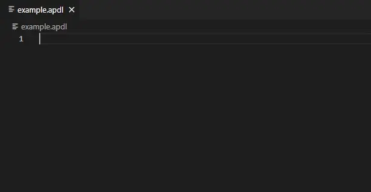

# APDL Language Support for Visual Studio Code

This plugin provides Hover, Signature and Completion language support for Ansys APDL to Visual Studio Code.

## Features

## TODO

- [x] Support all commands and functions in Ansys 2023R1
- [x] List Elements in `ET` command
- [x] Open Local/Online Help Files
- [x] Fix `Subtype` in `SECTYPE` command
- [x] Fix Enum Options for `*GET` command
- [ ] Variable Semantic Support
- [ ] Show Element Key Infomation for `KEYOPT` command
- [ ] Show Element Real constant Infomation for `R` command
- [ ] Show Section Infomation for `SECDATA` command

## Release Notes

See [CHANGELOG](CHANGELOG.md)
